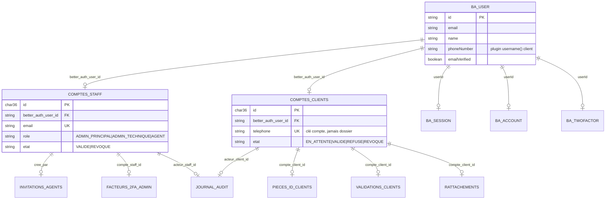
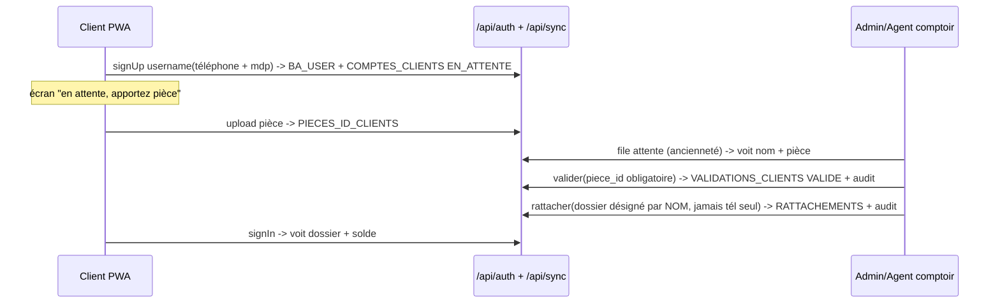
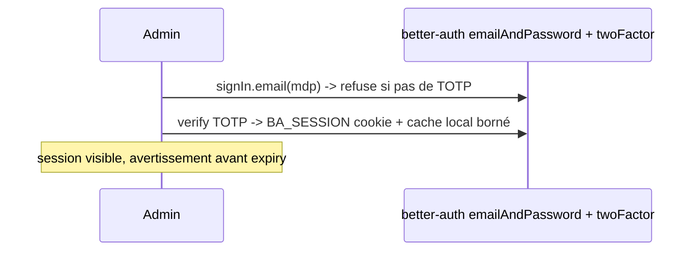
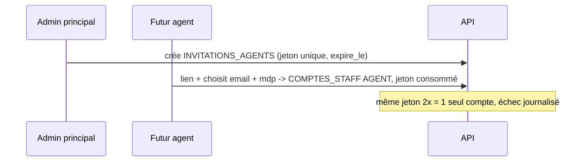
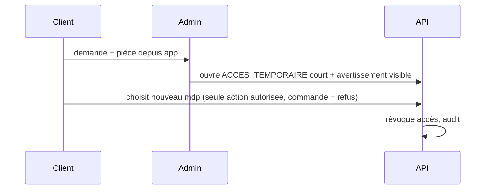
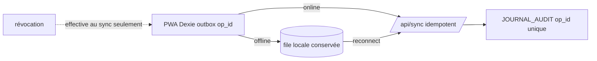

# TKS Auth — vue d'ensemble (schéma + workflows)

> Fichier unique pour décider l'auth avant code. Sources : S1 spec, S2 partiel, ADR-0006, GLOSSARY.
> Détails éclatés : `01-admin-comptes.md`, `02-comptes-clients.md`, `03-roles-audit.md`.

Stack : Next.js App Router + MySQL + Drizzle + better-auth + outbox IndexedDB (Dexie) -> `/api/sync`.
IDs : `CHAR(36)` UUID générés appareil, jamais `AUTO_INCREMENT` répliqué.

## 1. Schéma — qui vit où

better-auth génère et possède : `user`, `session`, `account`, `verification`, `twoFactor`.
Nous possédons : `comptes_staff`, `comptes_clients`, `invitations_agents`, `facteurs_2fa_admin`, `pieces_identite_*`, `validations_clients`, `rattachements`, `acces_temporaires_*`, `journal_audit`.

Règles verrouillées :
* Staff = email, jamais téléphone. Client = téléphone, jamais email admin. Deux tableaux, zéro mélange.
* Client inscrit `EN_ATTENTE_VALIDATION` ne fait rien : pas dossier, pas solde, pas commande même prépayée.
* `VALIDE` exige `piece_id NOT NULL`. Aucun chemin sans pièce vue humain.
* Rôle immuable. Changer = révoquer + recréer, tracé audit.
* Admin login sans TOTP = refus + journalisé. Admin technique ne voit ni `account`, ni `twoFactor`.

## 2. Workflows

### W1 — Client s'inscrit puis est validé puis rattaché

### W2 — Admin se connecte (2FA obligatoire)

### W3 — Agent invité

### W4 — Mot de passe oublié (sans SMS)

### W5 — Offline-first session + sync

Coupure réseau n'expire rien. Expiration temporelle expire même offline. Écritures faites avant révocation conservées -> conflit ADR-0005, jamais écrasées.

## 3. Ce qu'on implémente en premier

1. `npx auth generate` -> `src/db/auth-schema.ts` provider `mysql`, plugins `username`, `twoFactor`, `emailAndPassword`.
2. Migration `0001_auth_staff_client` : `comptes_staff`, `comptes_clients`, `invitations_agents`, `facteurs_2fa_admin`, `pieces`, `validations`, `rattachements`, `journal_audit` + triggers append-only.
3. Tests S1 bloquants : non-validé ne fait rien, pas de validation sans pièce, pas de rattachement par tél seul, jeton usage unique, 2FA refus sans TOTP, accès temporaire limité.

Le reste (taux, dossiers, commandes, trésorerie) attend après.
